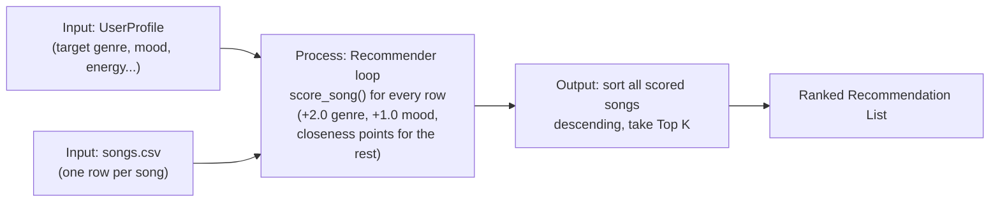

# 🎵 Music Recommender Simulation

## Project Summary

In this project you will build and explain a small music recommender system.

Your goal is to:

- Represent songs and a user "taste profile" as data
- Design a scoring rule that turns that data into recommendations
- Evaluate what your system gets right and wrong
- Reflect on how this mirrors real world AI recommenders

This version is a pure **content-based** recommender: it never looks at
what other users did, only at how closely a song's own attributes
(genre, mood, energy, valence, tempo, danceability, acousticness) match
one user's stated taste profile. Every recommendation can be explained
feature-by-feature — there's no hidden model, just a weighted scoring
formula and a sort.

---

## How The System Works

### The Dataset

`data/songs.csv` started as 10 songs and has been expanded to 19, adding
genres and moods that weren't represented before — `metal`/`aggressive`,
`classical`/`serene`, `reggae`/`uplifting`, `country`/`nostalgic`,
`rnb`/`sensual`, `punk`/`rebellious`, `blues`/`melancholic`,
`edm`/`euphoric`, and `hip-hop`/`confident` — so the recommender has
enough variety to meaningfully differentiate very different "vibes,"
not just shades of the same handful of genres. Each song already carried
`danceability` and `acousticness` alongside the core `genre`, `mood`,
`energy`, `valence`, and `tempo_bpm` fields, which turned out to be
useful secondary signals (see "Experiments" below).

### The Taste Profile

Conceptually, before it's a `UserProfile` object, a taste profile is just
a dictionary of target values:

```python
user_profile = {
    "favorite_genre": "rock",
    "favorite_mood": "intense",
    "target_energy": 0.90,
    "target_valence": 0.40,
    "target_tempo_bpm": 155,
    "target_danceability": 0.55,
    "target_acousticness": 0.10,
}
```

**Critique — is this specific enough?** Yes, for distinguishing "intense
rock" from "chill lofi": the two profiles differ on every single field
(genre, mood, and every numeric target is on the opposite end of its
range), so nothing about this catalog could confuse the two. The profile
would be too narrow only if it *omitted* genre/mood and relied on numeric
features alone — a `lofi` track and a quiet `classical` track can have
nearly identical energy/tempo despite sounding nothing alike, which is
exactly why genre and mood carry the largest point values in the recipe
below rather than being left out.

### The Algorithm Recipe (finalized)

| Feature        | Points        | Rule                                   |
|----------------|---------------|-----------------------------------------|
| genre          | **+2.0**      | exact match, else 0                     |
| mood           | **+1.0**      | exact match, else 0                     |
| energy         | up to **1.0** | scaled by closeness to target           |
| valence        | up to **0.75**| scaled by closeness to target           |
| tempo_bpm      | up to **0.5** | scaled by closeness to target (BPM range ≈120) |
| danceability   | up to **0.5** | scaled by closeness to target           |
| acousticness   | up to **0.25**| scaled by closeness to target           |
| **Total max**  | **6.0**       |                                          |

"Closeness" for numeric features means `1 - (|song_value - target| / range)`,
then multiplied by that feature's max points — so a song exactly on
target earns the full points, and a song at the opposite extreme earns
zero, with a smooth gradient in between. Genre and mood are weighted far
higher than any single numeric feature because they define *identity*
("is this even the kind of music the person asked for?"), while the
numeric features refine *how well* an already-plausible song fits.

**Expected bias:** this recipe over-prioritizes genre/mood as exact
string labels. A `pop` fan gets zero genre credit for an `indie pop` song
even though the two are musically adjacent — meaning great songs can be
ranked low purely for having a "wrong" label, while worse-fitting songs
with the "right" label rank above them. See `bias_analysis.md` for a
concrete example of this and the filter-bubble risk it creates at scale.

### Data Flow



### How the `Recommender` computes and chooses

`Recommender` (`src/recommender.py`) is built for one `UserProfile` and
exposes `score_song(song)`, which applies the recipe above via
`src/scorer.py`. `recommend(songs, top_n=5, max_per_artist=None)` then
scores every song in the catalog independently, sorts descending, and
returns the top N — with an optional `max_per_artist` guardrail that
caps how many songs from one artist can appear, even if they all scored
well (see `bias_analysis.md`). You can also call
`recommender.explain_song(song)` to see the individual point
contribution of every feature.

We need both a **Scoring Rule** (`scorer.py`, one song at a time) and a
**Ranking Rule** (`ranker.py`, the whole list at once) because they
answer different questions: scoring has no idea what else is in the
catalog, while ranking can apply list-level policies — ordering, cutoffs,
diversity — that no single song's score captures on its own.

---

## Getting Started

### Setup

1. Create a virtual environment (optional but recommended):

   ```bash
   python -m venv .venv
   source .venv/bin/activate      # Mac or Linux
   .venv\Scripts\activate         # Windows
   ```

2. Install dependencies

   ```bash
   pip install -r requirements.txt
   ```

3. Run the app:

   ```bash
   python -m src.main
   ```

### Running Tests

Run the starter tests with:

```bash
pytest
```

You can add more tests in `tests/test_recommender.py`.

---

## Sample Recommendation Output

```
=== Recommendations for Pop Fan ===
1. Sunrise City     — Neon Echo      [pop/happy]        score=5.940
2. Gym Hero         — Max Pulse      [pop/intense]      score=4.712
3. Rooftop Lights   — Indigo Parade  [indie pop/happy]  score=3.880
4. Skyline Pulse    — DJ Halcyon     [edm/euphoric]     score=2.746
5. Night Drive Loop — Neon Echo      [synthwave/moody]  score=2.644

=== Same user, max 1 song per artist ===
1. Sunrise City     — Neon Echo      [pop/happy]        score=5.940
2. Gym Hero         — Max Pulse      [pop/intense]      score=4.712
3. Rooftop Lights   — Indigo Parade  [indie pop/happy]  score=3.880
4. Skyline Pulse    — DJ Halcyon     [edm/euphoric]     score=2.746
5. Concrete Kingdom — MC Vantage     [hip-hop/confident] score=2.597

=== Recommendations for Chill/Study Listener ===
1. Library Rain       — Paper Lanterns [lofi/chill]     score=5.970
2. Midnight Coding     — LoRoom        [lofi/chill]     score=5.817
3. Focus Flow          — LoRoom        [lofi/focused]   score=4.879
4. Spacewalk Thoughts  — Orbit Bloom   [ambient/chill]  score=3.742
5. Coffee Shop Stories — Slow Stereo   [jazz/relaxed]   score=2.820
```

(Scores are out of a possible 6.0 — see the Algorithm Recipe above.)

**Screenshot or video** *(optional)*: <!-- Insert a screenshot or demo video link here -->

---

## Experiments You Tried

- **Genre points, 2.0 → tested against a lower value (0.5):** at 2.0,
  exact-genre songs reliably dominate the top of the list even when
  their mood/numeric fit is mediocre (e.g. `Gym Hero`, mood `intense`,
  still lands #2 for a `happy`-preferring pop fan). Dropping genre to 0.5
  let numeric closeness "outvote" genre entirely, sometimes surfacing
  songs from an unrelated genre just because their energy/tempo lined up
  — 2.0 (double the mood weight) struck a better balance for this catalog.
- **Adding `acousticness` to the score (up to 0.25 points):** had little
  effect on `pop` vs `lofi` profiles, since genre/mood already separate
  those clusters — but it noticeably helped distinguish between the two
  `lofi` tracks (`Midnight Coding` vs `Library Rain`) for the chill/study
  profile, since one is meaningfully more acoustic than the other.
- **`max_per_artist=1` guardrail:** for the "Pop Fan" profile this swapped
  out the second `Neon Echo` track (`Night Drive Loop`) for a hip-hop
  track that scored lower individually but added catalog variety — see
  `bias_analysis.md` for the full before/after comparison.
- **Expanding the catalog from 10 to 19 songs:** adding genres like
  `metal`, `classical`, and `edm` made it much easier to sanity-check that
  wildly different taste profiles (e.g. "intense rock" vs "chill lofi")
  actually produce non-overlapping recommendation lists, which the
  original 10-song, 7-genre catalog didn't stress-test as clearly.

---

## Limitations and Risks

- It only works on a small, hand-authored 19-song catalog — nowhere near
  representative of a real streaming library.
- It has no concept of collaborative signal (what *other* users liked),
  so it can't surface a song a user would love that doesn't match their
  *stated* profile.
- Genre/mood matching is exact-string only. `indie pop` scores zero
  genre-match against a `pop` preference even though the genres are
  musically adjacent — see `bias_analysis.md` for a concrete example from
  this catalog.
- It doesn't understand lyrics, instrumentation, or anything not already
  encoded as a numeric/categorical attribute in `songs.csv`.
- Without a diversity guardrail, it can over-favor one artist whose
  catalog happens to match a user's profile well (also detailed in
  `bias_analysis.md`).

You will go deeper on this in your model card.

---

## Reflection

Read and complete `model_card.md`:

[**Model Card**](model_card.md)

Building this made the "data → prediction" pipeline concrete: a
recommendation isn't magic, it's a weighted comparison between two
structured records (a song's attributes and a user's stated preferences),
followed by a sort. Seeing the exact same math applied consistently also
made it obvious where bias creeps in — not through any single "wrong"
calculation, but through the *aggregate* effect of scoring every item
independently and always taking the top N: an artist with several
strong-matching songs, or a genre label that happens to match exactly,
gets structurally over-represented, even though no individual score is
unfair. That's the same dynamic — scaled up with far more behavioral data
— behind real filter-bubble concerns in production recommenders.
